# GRS_AD64
This is the code used to decode packages from GRS_AD64, based on version 2.0 2019.06 data sheet

## How to use the code
To use this code, `python3` and packages of `numpy`,`matplotlib`,`tqdm`,`sk-learn` are requied. To use the code, create a folder `data_file` in the same path as the code, change variable `file_name` to the bin file you want to process. 
```
file_name = "data_file/your_file_name.bin"
```
Create a folder `Noise_level` to store noise data(if needed)

## How the code works
This is a flow chart of the unpack code.

```mermaid
graph LR
  A["Read .bin file"]-->B["Find package head and tail"]
  B-->C["Check pack error, package length"]
  C-->D["Use board id, package id and time of repentance of package id to label a general package"]
  D-->E["Unpack subpackage"]
  E-->F["Label wave data package"]
  F-->G["Find subpackage channel id, subpackage trigger source and subpackage trigger count"]
  G-->H["Unpack wave data"]
  H-->I["Use board id, channel id and time stamp to re-label a general package"]
  I-->J["Process external trigger (if there`s one)"]
  J-->K["Find events"]
```


## Data structure
Here is a chart showing the data structure generated by the file(when using external trigger)
```bash
File
|-- A file contains mutitple events
|   |-- An event contains 1-3 external trigger count
|   |   |-- There would be multiple ADC data package having the same external trigger count
|   |   |   |-- Every ADC data package have a board ID, channel ID, time stamp, and its data points
```

## Packed function
21 Jan 2026

Now the unpack part of the code is packed as a function, just for simplification. Function stored in `unpack_package.py`. This function requires `numpy`,`tqdm`,`sklearn`.
To use the function 

`from unpack_package import UnpackPackage`

The output contains two dictionary `Package_data` and `Trigger_data`

`Package_data` is unique and independ with trigger type, contains information with all datas in the file.

The data structure is shown
```
Package_data
|-- "PackagePointer": Pointer labeling package with board id channel id and time stamp
|-- "PackagePointerValid": True means this pointer is used

|-- "ExistedBoardId": All possible board id existed in the file
|-- "ExistedChannelId": All possible channel id existed in the file
|-- "ExistedTimeStamp": All possible time stamp existed in the file

|-- "BoardId": Board id of the package
|-- "SubPackageChannelId": Subpakage channel id
|-- "SubPackageTriggerStamp": Subpakage trigger stamp
|-- "SubPackageTriggerCount": Subpakage trigger count

|-- "WaveSampleData": Wave sample data of the package pointed by the pointer
|-- "WaveSampleDataValid": True if this element in the wave sample is used
```

`Trigger_data` contains information of events in generated, this dictionary various when using external or internal data

If there is external trigger package in the file, the code is going to use time stamp in external trigger to reconstruct event. The data structure is shown
```
`Trigger_data`
|-- "EventNum": Number of events
|-- "EventExtTriggerCountNum": Number of trigger counts in a event
|-- "EventExtTriggerCount": Trigger counts in a event
|-- "EventExtTriggerTimeStamp": Time stamp in of the event
|-- "EventExtTriggerTimeStampExcceed": If the time stamp exceeds
```

If there is no external trigger package, i.e. the file only contains wave data package, the code would use internal timestamp to reconstruct the events. The data structure is shown
```
`Trigger_data`
|-- "EventNum": Number of events
|-- "EventIntTimeStamp": Time stamp in a event
|-- "EventIntTimeStampValid": If this element is used
```