# GRS_AD64
This is the code used to decode packages from GRS_AD64, based on version 2.0 2019.06 data sheet

## How to use the code
To use this code, `python3` and packages of `numpy`,`matplotlib`,`tqdm` are requied. To use the code, create a folder `data_file` in the same path as the code, change variable `file_name` to the bin file you want to process. 
```
file_name = "data_file/your_file_name.bin"
```
Create a folder `Noise_level` to store noise data(if needed)

## How the code works
This is a flow chart of the unpack code.

```mermaid
graph LR
  A["Read .bin file"]-->B["Find package head and tail"]
  B-->C["Check pack error, package length"]
  C-->D["Use board id, package id and time of repentance of package id to label a general package"]
  D-->E["Unpack subpackage"]
  E-->F["Label wave data package"]
  F-->G["Find subpackage channel id, subpackage trigger source and subpackage trigger count"]
  G-->H["Unpack wave data"]
  H-->I["Use board id, channel id and time stamp to re-label a general package"]
  I-->J["Process external trigger (if there`s one)"]
  J-->K["Find events"]
```


## Data structure
Here is a chart showing the data structure generated by the file(when using external trigger)
```bash
File
|-- A file contains mutitple events
|   |-- An event contains 1-3 external trigger count
|   |   |-- There would be multiple ADC data package having the same external trigger count
|   |   |   |-- Every ADC data package have a board ID, channel ID, time stamp, and its data points
```